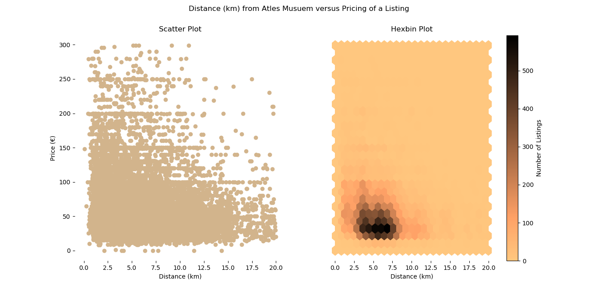

# ML-with-Visuals
+ [Project Description](#ProjectDescription)
+ [Findings](#Findings)
+ [Setting up the Envirnonment](#SettinguptheEnvirnonment)
+ [Acknowledgements](#Acknowledgements)

## Project Description
This repo seeks to explore Berlin Airbnb data and determine how listing are distributed across the city as well as to make predictions on the pricing of such listings.

## Findings
#### Geographic Analysis
So far, it has been determined that Airbnb listings are centered around 52.509824 N, 13.406107 E. This location is very close to Museum Island, which is surrounded by numerous attractions and landmarks. Interestingly enough, the "median" location listing is some distance removed from Großer Tiergarten, a major urban park that encompasses numerous Berlin landmarks including the Reichstag. This is probably due to the airport being on the western side of the city, thus reducing the number of listing available in that area as well as the park itself, which does cover a large part of the city. This visualization below was created in `visuals/visualHexbin.py` and shows the frequency of Airbnb listings based on location. Note that the graph only displays data that fell between the 5th and 95th percentile for both latitude and longitude. This was done to account of geographic outliers as well as provide an enlarged view of the data.

Graph Annotations:
* MD: calculated median of data
* AT: The Altes Museum, which is located on Museum Island
* GT: Major Urban Park that encompasses the Reichstag

#### Distance versus Price: Atles Museum
Seeing that the Altes Museum was fairly close to the Median Point, I decided to explore the distance of a listing from the Atles Museum and the price of the listing.

As expected, the bluk of the lisitings as some distance away from the museum, and those that are closer are able to garner higher prices. As the distance increases, and the lisiting leaves central Berlin, the maximum price begins to rapidly fall and appears to cluster between 0 and 100 euros.
#### Price Predictions
Currently, using a Tree Regression Model, we can determine the price of a listing with a mean absolute error of €24.31. Such a model takes 59.55 seconds to run. However, when we drop fields such as host_name, last_review, and name, the mean absolute error increases to €28.75, but the time take to find these results is drastically less: 10.34 seconds. 
## Setting up the Environment
* `pip install -r requirements.txt`

## Acknowledgements
* Data taken from [Kaggle](https://www.kaggle.com/brittabettendorf/berlin-airbnb-data) 
* `treeRegModel.py` was adapted from [Kaggle's ML Course](https://www.kaggle.com/learn/intermediate-machine-learning) 
* Project organization is based on [Cookie Cutter Data Science](https://github.com/drivendata/cookiecutter-data-science)
